# POS Transactions Platform

Plataforma cloud-native de microserviços para processamento de transações POS (Point of Sale), construída com Java 17 e Spring Boot 3.3.x em **monorepo Maven com 3 módulos independentes**.

> **Referência arquitetural**: Veja [ARCHITECTURE.md](./ARCHITECTURE.md) para análise completa baseada em Domain-Driven Design (DDD), Bounded Contexts, e decisões de design.

---

## Sumário

1. [Arquitetura de Microserviços](#1-arquitetura-de-microserviços)
2. [Serviços do Docker Compose](#2-serviços-do-docker-compose)
3. [Endpoints da API](#3-endpoints-da-api)
4. [Diagramas de Sequência — Fluxos Principais](#4-diagramas-de-sequência--fluxos-principais)
5. [Critérios de Aceite — Passo a Passo](#5-critérios-de-aceite--passo-a-passo)
6. [Segurança — HMAC SHA-256](#6-segurança--hmac-sha-256)
7. [Idempotência Distribuída](#7-idempotência-distribuída)
8. [Resiliência — Anti-Cascade](#8-resiliência--anti-cascade)
9. [Observabilidade](#9-observabilidade)
10. [Como Executar](#10-como-executar)
11. [Testes](#11-testes)
12. [Collection Postman](#12-collection-postman)
13. [Estrutura do Projeto](#13-estrutura-do-projeto)

---

## 1. Arquitetura de Microserviços

O sistema é composto por **dois microserviços independentes** mais o banco de dados:

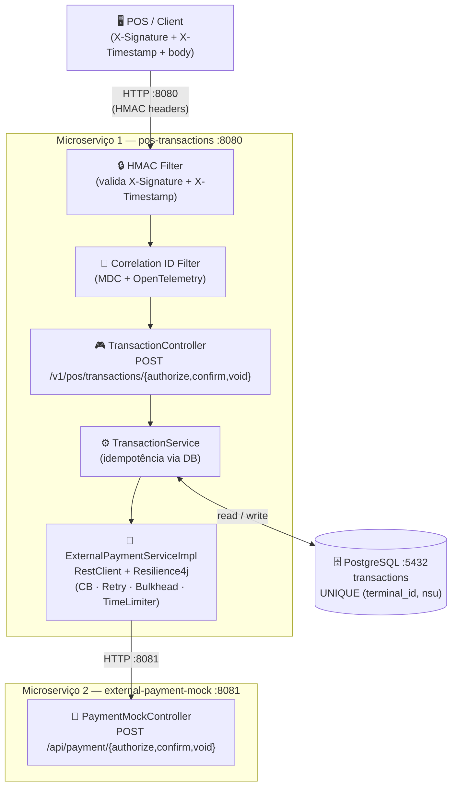

### Responsabilidades

| Microserviço | Porta | Responsabilidade |
|---|---|---|
| **pos-transactions** | 8080 | Orquestrador: recebe POS, valida HMAC, aplica idempotência, persiste e chama mock |
| **external-payment-mock** | 8081 | Simula a adquirente/processadora real (Cielo, Rede, Stone etc.) |
| **postgres** | 5432 | Persistência de transações com controle de unicidade |

---

## 2. Serviços do Docker Compose

Ordem de inicialização garantida por `healthcheck` + `depends_on`:

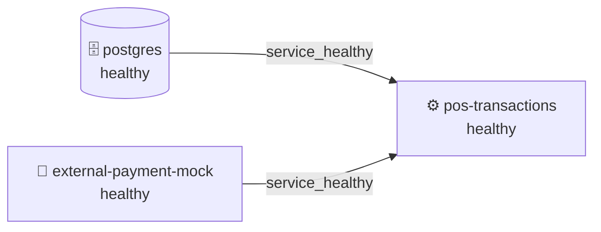

```yaml
services:
  postgres:               # Banco de dados
  external-payment-mock:  # Mock da API externa (microserviço independente)
  pos-transactions:       # API principal (depende dos dois acima)
```

---

## 3. Endpoints da API

### 3.1 Autorizar Transação

```http
POST /v1/pos/transactions/authorize
Content-Type: application/json
X-Timestamp: 1715000000
X-Signature: <hmac-sha256>

{
  "nsu": "123456",
  "amount": 199.90,
  "terminalId": "T-1000"
}
```

**Response 200 OK:**
```json
{
  "nsu": "123456",
  "amount": 199.90,
  "terminalId": "T-1000",
  "transactionId": "A1B2C3D4E5F6..."
}
```

### 3.2 Confirmar Transação

```http
POST /v1/pos/transactions/confirm
Content-Type: application/json
X-Timestamp: 1715000000
X-Signature: <hmac-sha256>

{ "transactionId": "A1B2C3D4E5F6..." }
```

**Response:** `204 No Content`

### 3.3 Desfazer Transação (Void)

```http
POST /v1/pos/transactions/void
Content-Type: application/json
X-Timestamp: 1715000000
X-Signature: <hmac-sha256>
```

**Forma A — por transactionId:**
```json
{ "transactionId": "A1B2C3D4E5F6..." }
```

**Forma B — por nsu + terminalId:**
```json
{ "nsu": "123456", "terminalId": "T-1000" }
```

**Response:** `204 No Content`

### Códigos de Erro

| Código | Situação |
|---|---|
| `400` | Campos obrigatórios ausentes ou inválidos |
| `401` | Assinatura HMAC inválida ou timestamp expirado |
| `404` | Transação não encontrada |
| `422` | Estado inválido (ex: confirmar transação VOIDED) |
| `503` | Circuit Breaker aberto (mock indisponível) |

---

## 4. Diagramas de Sequência — Fluxos Principais

### 4.1 Autorizar — Transação Nova (caminho feliz)

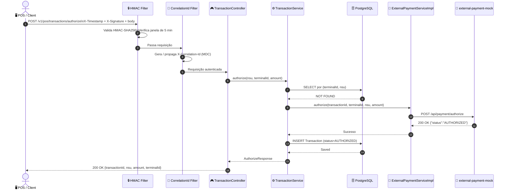

### 4.2 Autorizar — Idempotência (transação já existe)

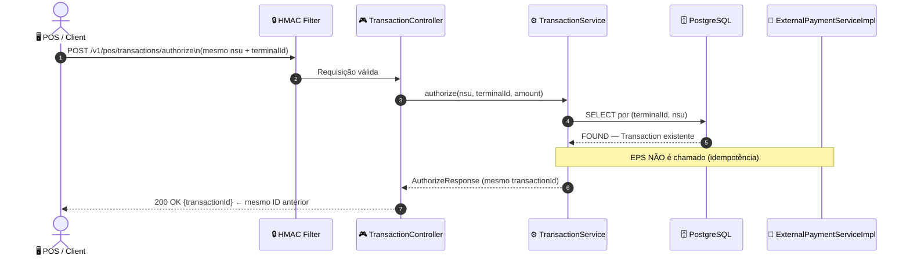

### 4.3 Confirmar — Caminho Feliz

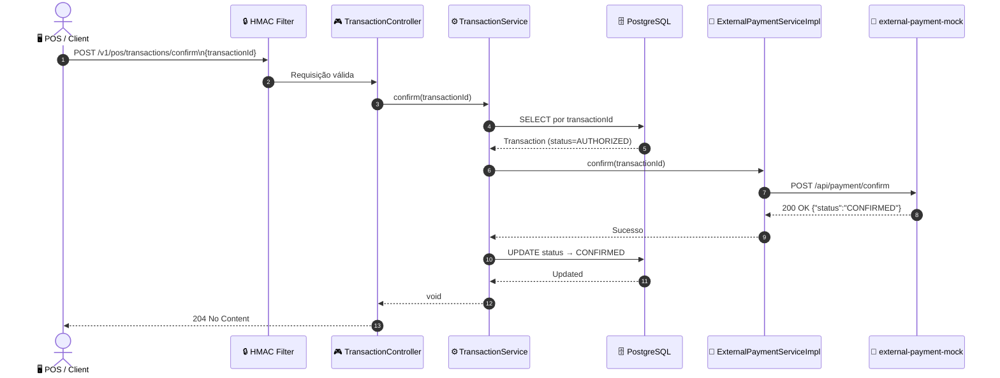

### 4.4 Confirmar — Idempotência (já confirmada)

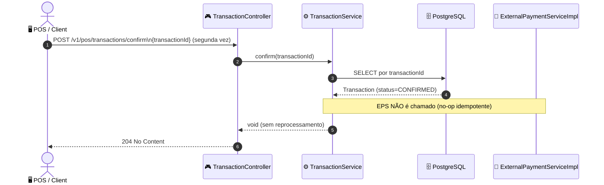

### 4.5 Desfazer (Void) — Caminho Feliz

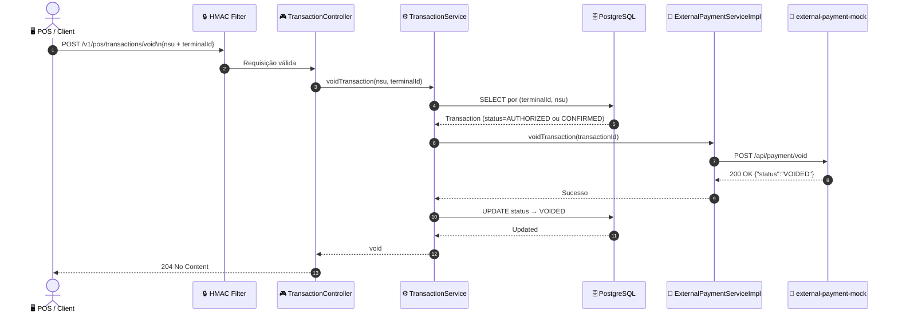

### 4.6 Desfazer (Void) — Idempotência (já desfeita)

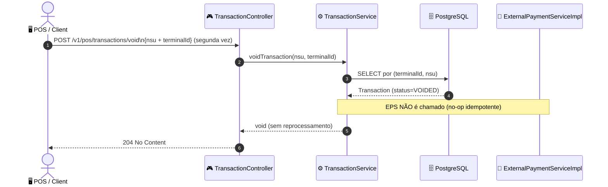

### 4.7 Segurança — Validação HMAC

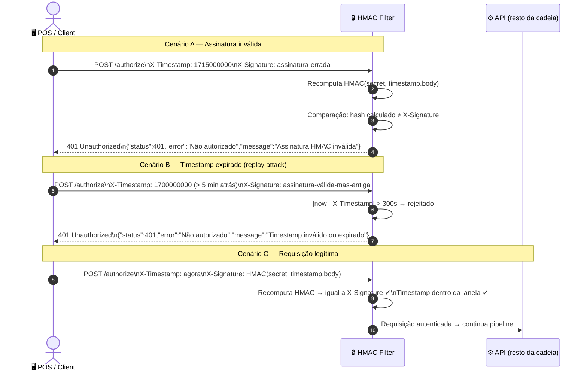

### 4.8 Resiliência — Circuit Breaker Aberto

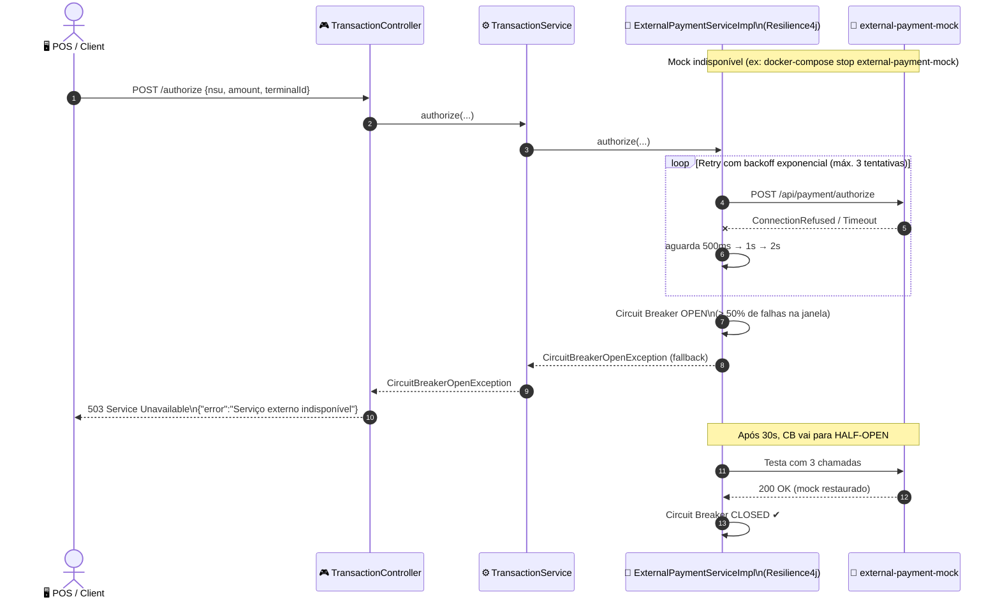

### 4.9 Resiliência — Retry com Backoff Exponencial

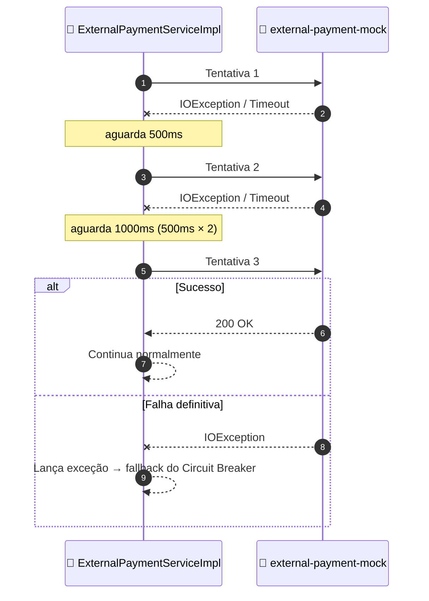

---

## 5. Critérios de Aceite — Passo a Passo

### Pré-requisitos

- Docker e Docker Compose instalados
- Maven 3.9+ e Java 17+ (para build local)

### Passo 1 — Build das imagens

```bash
# Build do módulo principal
mvn clean package -DskipTests

# Build do mock externo
cd external-payment-mock
mvn clean package -DskipTests
cd ..
```

### Passo 2 — Subir todos os serviços

```bash
docker-compose up -d
```

Aguarde até que todos estejam saudáveis:

```bash
docker-compose ps
# Saída esperada:
# NAME                    STATUS
# pos-postgres            Up (healthy)
# external-payment-mock   Up (healthy)
# pos-transactions-api    Up (healthy)
```

### Passo 3 — Verificar saúde dos serviços

```bash
# API principal
curl http://localhost:8080/actuator/health

# Mock externo
curl http://localhost:8081/actuator/health
```

Resposta esperada: `{"status":"UP",...}`

### Passo 4 — Gerar assinatura HMAC (necessário para todos os endpoints)

```bash
TIMESTAMP=$(date +%s)
BODY='{"nsu":"123456","amount":199.90,"terminalId":"T-1000"}'
SECRET="my-super-secret-key-change-in-production"

SIGNATURE=$(echo -n "${TIMESTAMP}.${BODY}" | \
  openssl dgst -sha256 -hmac "${SECRET}" | awk '{print $2}')
```

### Passo 5 — Fluxo completo: Autorizar → Confirmar → Void

#### 5.1 Autorizar transação nova (veja [diagrama 4.1](#41-autorizar--transação-nova-caminho-feliz))

```bash
curl -s -X POST http://localhost:8080/v1/pos/transactions/authorize \
  -H "Content-Type: application/json" \
  -H "X-Timestamp: ${TIMESTAMP}" \
  -H "X-Signature: ${SIGNATURE}" \
  -d "${BODY}" | jq .
```

Resposta esperada (`200 OK`):
```json
{
  "nsu": "123456",
  "amount": 199.90,
  "terminalId": "T-1000",
  "transactionId": "A1B2C3D4E5F60708..."
}
```

Salve o `transactionId` retornado:
```bash
TRANSACTION_ID="A1B2C3D4E5F60708..."
```

#### 5.2 Idempotência na autorização (veja [diagrama 4.2](#42-autorizar--idempotência-transação-já-existe))

Repita exatamente a mesma requisição — deve retornar o mesmo `transactionId`:

```bash
# Gere novo HMAC para o mesmo body (timestamp novo, mesmos dados)
TIMESTAMP=$(date +%s)
SIGNATURE=$(echo -n "${TIMESTAMP}.${BODY}" | openssl dgst -sha256 -hmac "${SECRET}" | awk '{print $2}')

curl -s -X POST http://localhost:8080/v1/pos/transactions/authorize \
  -H "Content-Type: application/json" \
  -H "X-Timestamp: ${TIMESTAMP}" \
  -H "X-Signature: ${SIGNATURE}" \
  -d "${BODY}" | jq .transactionId
# Esperado: "A1B2C3D4E5F60708..." (mesmo ID, sem duplicar)
```

#### 5.3 Confirmar a transação (veja [diagrama 4.3](#43-confirmar--caminho-feliz))

```bash
CONFIRM_BODY="{\"transactionId\":\"${TRANSACTION_ID}\"}"
TIMESTAMP=$(date +%s)
SIGNATURE=$(echo -n "${TIMESTAMP}.${CONFIRM_BODY}" | openssl dgst -sha256 -hmac "${SECRET}" | awk '{print $2}')

curl -s -o /dev/null -w "%{http_code}" \
  -X POST http://localhost:8080/v1/pos/transactions/confirm \
  -H "Content-Type: application/json" \
  -H "X-Timestamp: ${TIMESTAMP}" \
  -H "X-Signature: ${SIGNATURE}" \
  -d "${CONFIRM_BODY}"
# Esperado: 204
```

#### 5.4 Idempotência na confirmação (veja [diagrama 4.4](#44-confirmar--idempotência-já-confirmada))

```bash
# Repetição — deve retornar 204 sem reprocessar
TIMESTAMP=$(date +%s)
SIGNATURE=$(echo -n "${TIMESTAMP}.${CONFIRM_BODY}" | openssl dgst -sha256 -hmac "${SECRET}" | awk '{print $2}')

curl -s -o /dev/null -w "%{http_code}" \
  -X POST http://localhost:8080/v1/pos/transactions/confirm \
  -H "Content-Type: application/json" \
  -H "X-Timestamp: ${TIMESTAMP}" \
  -H "X-Signature: ${SIGNATURE}" \
  -d "${CONFIRM_BODY}"
# Esperado: 204
```

#### 5.5 Desfazer transação por NSU + terminalId (veja [diagrama 4.5](#45-desfazer-void--caminho-feliz))

```bash
VOID_BODY='{"nsu":"123456","terminalId":"T-1000"}'
TIMESTAMP=$(date +%s)
SIGNATURE=$(echo -n "${TIMESTAMP}.${VOID_BODY}" | openssl dgst -sha256 -hmac "${SECRET}" | awk '{print $2}')

curl -s -o /dev/null -w "%{http_code}" \
  -X POST http://localhost:8080/v1/pos/transactions/void \
  -H "Content-Type: application/json" \
  -H "X-Timestamp: ${TIMESTAMP}" \
  -H "X-Signature: ${SIGNATURE}" \
  -d "${VOID_BODY}"
# Esperado: 204
```

#### 5.6 Idempotência no void (veja [diagrama 4.6](#46-desfazer-void--idempotência-já-desfeita))

```bash
# Repetição — deve retornar 204 sem reprocessar
TIMESTAMP=$(date +%s)
SIGNATURE=$(echo -n "${TIMESTAMP}.${VOID_BODY}" | openssl dgst -sha256 -hmac "${SECRET}" | awk '{print $2}')

curl -s -o /dev/null -w "%{http_code}" \
  -X POST http://localhost:8080/v1/pos/transactions/void \
  -H "Content-Type: application/json" \
  -H "X-Timestamp: ${TIMESTAMP}" \
  -H "X-Signature: ${SIGNATURE}" \
  -d "${VOID_BODY}"
# Esperado: 204
```

#### 5.7 Verificar circuit breaker

```bash
# Ver status do circuit breaker (externalPaymentApi deve estar CLOSED)
curl -s http://localhost:8080/actuator/health | jq '.components.circuitBreakers'
```

#### 5.8 Simular circuit breaker aberto (veja [diagrama 4.8](#48-resiliência--circuit-breaker-aberto))

```bash
docker-compose stop external-payment-mock

# Tentar autorizar nova transação — deve receber 503
BODY2='{"nsu":"NOVO-NSU","amount":50.00,"terminalId":"T-2000"}'
TIMESTAMP=$(date +%s)
SIGNATURE=$(echo -n "${TIMESTAMP}.${BODY2}" | openssl dgst -sha256 -hmac "${SECRET}" | awk '{print $2}')

curl -s -w "\nHTTP: %{http_code}\n" \
  -X POST http://localhost:8080/v1/pos/transactions/authorize \
  -H "Content-Type: application/json" \
  -H "X-Timestamp: ${TIMESTAMP}" \
  -H "X-Signature: ${SIGNATURE}" \
  -d "${BODY2}"
# Esperado: HTTP 503 (após retry/CB abrir)

# Restaurar o mock
docker-compose start external-payment-mock
```

---

## 6. Segurança — HMAC SHA-256

Cada requisição deve conter:

| Header | Descrição |
|---|---|
| `X-Timestamp` | Unix timestamp em segundos (janela válida: ±5 minutos) |
| `X-Signature` | HMAC-SHA256 hexadecimal de `"${timestamp}.${body}"` |
| `X-Correlation-Id` | Opcional; gerado automaticamente se ausente |

**Fórmula da assinatura:**
```
X-Signature = HEX( HMAC-SHA256( secret, "${X-Timestamp}.${requestBody}" ) )
```

**Proteções (veja [diagrama 4.7](#47-segurança--validação-hmac)):**
- Requisições forjadas: sem a chave secreta não é possível gerar assinatura válida
- Replay attacks: timestamp fora da janela de 5 minutos é rejeitado com `401`

---

## 7. Idempotência Distribuída

A idempotência é garantida por `UNIQUE CONSTRAINT (terminal_id, nsu)` no PostgreSQL — **sem estado local em memória**, seguro para múltiplos pods:

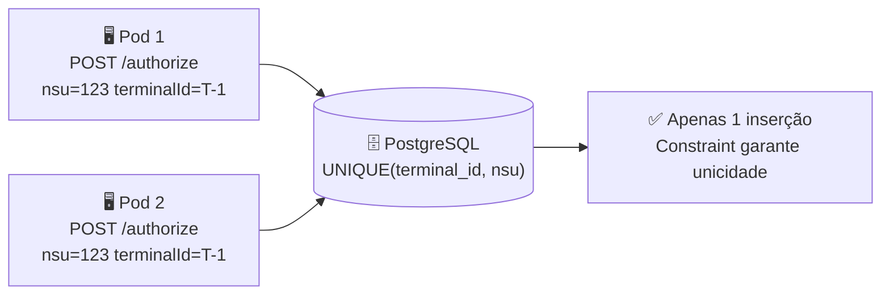

| Operação | Estado atual | Comportamento |
|---|---|---|
| `authorize` | Não existe | Cria nova transação (chama mock) |
| `authorize` | Já existe | Retorna existente (sem chamar mock) |
| `confirm` | `AUTHORIZED` | Confirma (chama mock) → status `CONFIRMED` |
| `confirm` | `CONFIRMED` | No-op — `204` sem chamar mock |
| `confirm` | `VOIDED` | Erro `422 Unprocessable Entity` |
| `void` | `AUTHORIZED` ou `CONFIRMED` | Desfaz (chama mock) → status `VOIDED` |
| `void` | `VOIDED` | No-op — `204` sem chamar mock |

---

## 8. Resiliência — Anti-Cascade

Toda comunicação com o `external-payment-mock` passa por 4 camadas de proteção (veja [diagramas 4.8](#48-resiliência--circuit-breaker-aberto) e [4.9](#49-resiliência--retry-com-backoff-exponencial)):

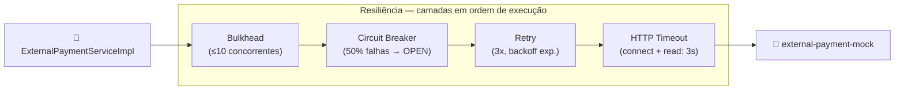

> **Nota sobre Timeout:** O timeout é aplicado diretamente no `SimpleClientHttpRequestFactory` do `RestClient` (connect + read: 3 s), garantindo que chamadas síncronas nunca fiquem penduradas indefinidamente. Esta abordagem é equivalente ao `TimeLimiter` do Resilience4j e não exige refatoração para `CompletableFuture`.

### Circuit Breaker

| Parâmetro | Valor | Significado |
|---|---|---|
| `slidingWindowSize` | 10 | Janela de avaliação |
| `minimumNumberOfCalls` | 5 | Mínimo para calcular taxa |
| `failureRateThreshold` | 50% | Abre com ≥ 50% de falhas |
| `slowCallRateThreshold` | 80% | Conta chamadas > 2s como falha |
| `waitDurationInOpenState` | 30s | Permanece aberto por 30s |
| `permittedNumberOfCallsInHalfOpenState` | 3 | Testa com 3 chamadas no HALF-OPEN |

Quando **aberto**: retorna `503 Service Unavailable` imediatamente (fail-fast).

### Retry com Backoff Exponencial

| Tentativa | Aguarda antes |
|---|---|
| 1ª | — |
| 2ª | 500ms |
| 3ª | 1000ms |

Anti-retry storm: `CircuitBreakerOpenException` e erros de negócio **nunca geram retry**.

### Bulkhead

```yaml
maxConcurrentCalls: 10    # Máximo simultâneo ao mock
maxWaitDuration: 100ms    # Tempo máximo aguardando slot
```

### Timeout HTTP

```yaml
external.payment.timeout-ms: 3000   # connect + read timeout (ms) no HttpClient
```

O timeout é configurado via `SimpleClientHttpRequestFactory` no `RestClient`, aplicando-se tanto à conexão TCP quanto à leitura da resposta. Chamadas que excedam 3 s lançam `ResourceAccessException`, que é registrada pelo Circuit Breaker e elegível para Retry.

---

## 9. Observabilidade

- **Correlation ID**: propagado via `X-Correlation-Id` em todos os logs (MDC) e headers de resposta
- **Logs estruturados**: `[correlationId=abc-123] INFO TransactionService - [AUTHORIZE] ...`
- **Actuator endpoints**:
  - `GET /actuator/health` — saúde + status do Circuit Breaker
  - `GET /actuator/health/circuitBreakers` — detalhes do CB
  - `GET /actuator/metrics` — métricas Micrometer

---

## 10. Como Executar

### Build e start completo (recomendado)

```bash
# 1. Build dos JARs
mvn clean package -DskipTests
cd external-payment-mock && mvn clean package -DskipTests && cd ..

# 2. Build das imagens e start
docker-compose up --build -d

# 3. Aguardar saúde
docker-compose ps

# 4. Verificar
curl http://localhost:8080/actuator/health
curl http://localhost:8081/actuator/health
```

### Apenas o banco + mock (desenvolvimento local)

```bash
docker-compose up -d postgres external-payment-mock
mvn spring-boot:run
```

### Variáveis de Ambiente

| Variável | Padrão | Descrição |
|---|---|---|
| `DATABASE_URL` | `jdbc:postgresql://localhost:5432/pos_transactions` | URL do banco |
| `DATABASE_USERNAME` | `pos_user` | Usuário do banco |
| `DATABASE_PASSWORD` | `pos_password` | Senha do banco |
| `HMAC_SECRET` | `my-super-secret-key-change-in-production` | Chave secreta HMAC |
| `HMAC_ENABLED` | `true` | Habilitar/desabilitar validação HMAC |
| `EXTERNAL_PAYMENT_URL` | `http://localhost:8081` | URL do microserviço mock |

> ⚠️ Em produção, substitua `HMAC_SECRET` e `DATABASE_PASSWORD` por segredos gerenciados (AWS Secrets Manager, Kubernetes Secrets).

---

## 11. Testes

```bash
# Todos os testes (unitários + BDD)
mvn test

# Apenas unitários
mvn test -Dtest="**/unit/**"

# Apenas BDD Cucumber
mvn test -Dtest="CucumberTestRunner"
```

### Suítes

| Suite | Testes | Cobertura |
|---|---|---|
| Unitário — `TransactionService` | 10 | authorize, confirm, void, idempotência, erros de estado |
| Unitário — `HmacSignatureFilter` | 5 | assinatura válida/inválida, timestamp, replay |
| BDD — `authorize_transaction.feature` | 2 | nova transação, idempotência |
| BDD — `confirm_transaction.feature` | 2 | confirmação, idempotência |
| BDD — `void_transaction.feature` | 2 | void, idempotência |
| **Total** | **21** | |

Os testes BDD usam WireMock (porta 8181) para interceptar as chamadas HTTP ao mock externo, sem precisar de infraestrutura real.

---

## 12. Collection Postman

O arquivo `pos-transactions-collection.json` contém a collection completa com:

- Pre-request scripts que geram automaticamente `X-Signature` e `X-Timestamp` via CryptoJS
- Testes automatizados para todos os endpoints
- Cenários de idempotência (authorize, confirm, void)
- Validações de erro (400, 404)
- Health check e status do Circuit Breaker

**Importar:**
1. Postman → Import → `pos-transactions-collection.json`
2. Ajustar `baseUrl` se necessário (padrão: `http://localhost:8080`)
3. "Run Collection" para validar toda a cadeia

---

## 13. Estrutura do Projeto

```
pos-transactions/                        ← repositório raiz
│
├── external-payment-mock/               ← Microserviço mock (API externa)
│   ├── Dockerfile
│   ├── pom.xml
│   └── src/main/java/com/pos/external/
│       ├── ExternalPaymentMockApplication.java
│       ├── controller/PaymentMockController.java
│       └── dto/
│           ├── AuthorizePaymentRequest.java
│           ├── TransactionPaymentRequest.java
│           └── PaymentResponse.java
│
├── src/                                 ← Microserviço principal
│   ├── main/java/com/pos/transactions/
│   │   ├── PosTransactionsApplication.java
│   │   ├── config/
│   │   │   ├── CachedBodyHttpServletRequest.java
│   │   │   ├── CorrelationIdFilter.java
│   │   │   ├── HmacSignatureFilter.java
│   │   │   ├── Resilience4jConfig.java
│   │   │   └── SecurityConfig.java
│   │   ├── controller/
│   │   │   ├── TransactionController.java
│   │   │   └── GlobalExceptionHandler.java
│   │   ├── domain/
│   │   │   ├── Transaction.java
│   │   │   └── TransactionStatus.java
│   │   ├── dto/
│   │   ├── exception/
│   │   ├── repository/TransactionRepository.java
│   │   └── service/
│   │       ├── ExternalPaymentService.java        ← interface
│   │       ├── ExternalPaymentServiceImpl.java    ← RestClient + Resilience4j
│   │       └── TransactionService.java
│   └── main/resources/
│       ├── application.yml
│       └── db/migration/V1__create_transactions.sql
│
├── docker-compose.yml                   ← postgres + mock + pos-transactions
├── Dockerfile                           ← imagem do microserviço principal
├── pom.xml
└── pos-transactions-collection.json    ← collection Postman
```
