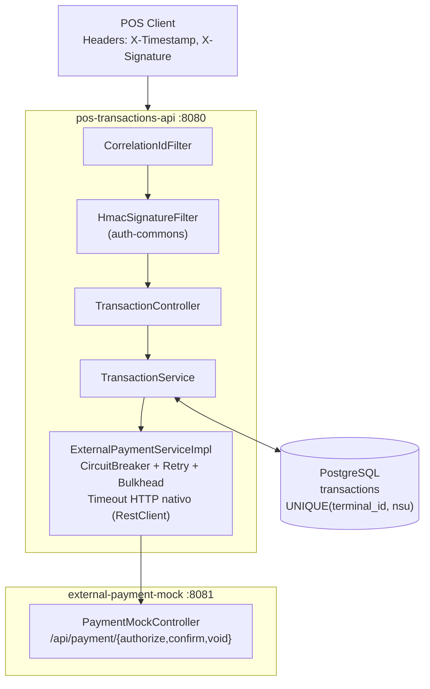
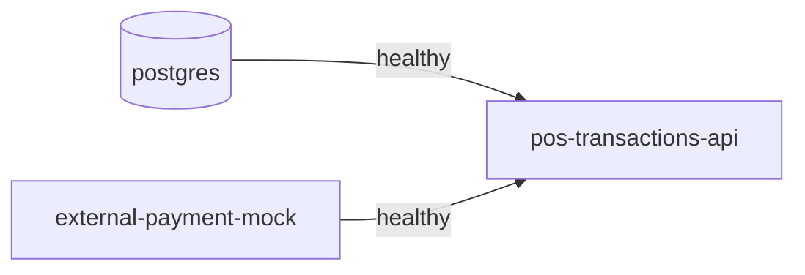
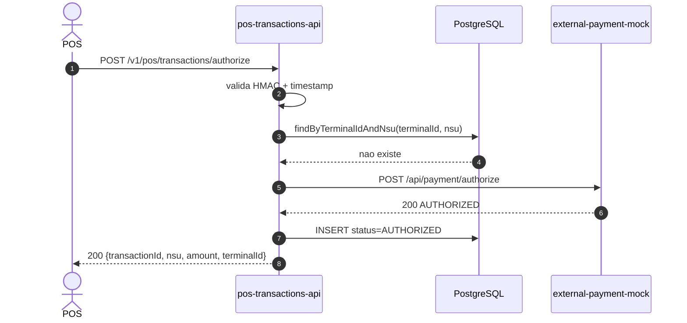
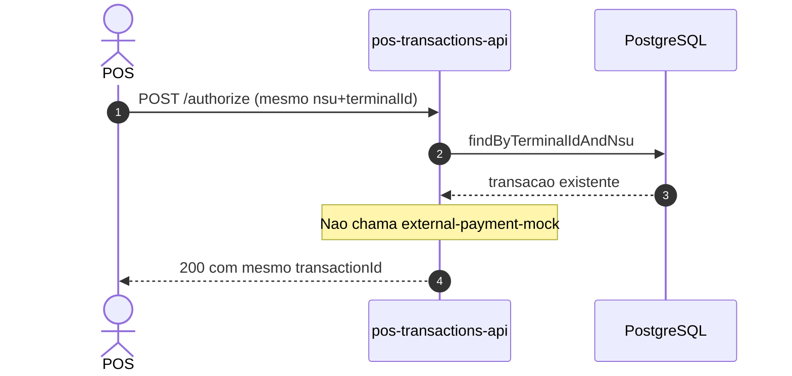
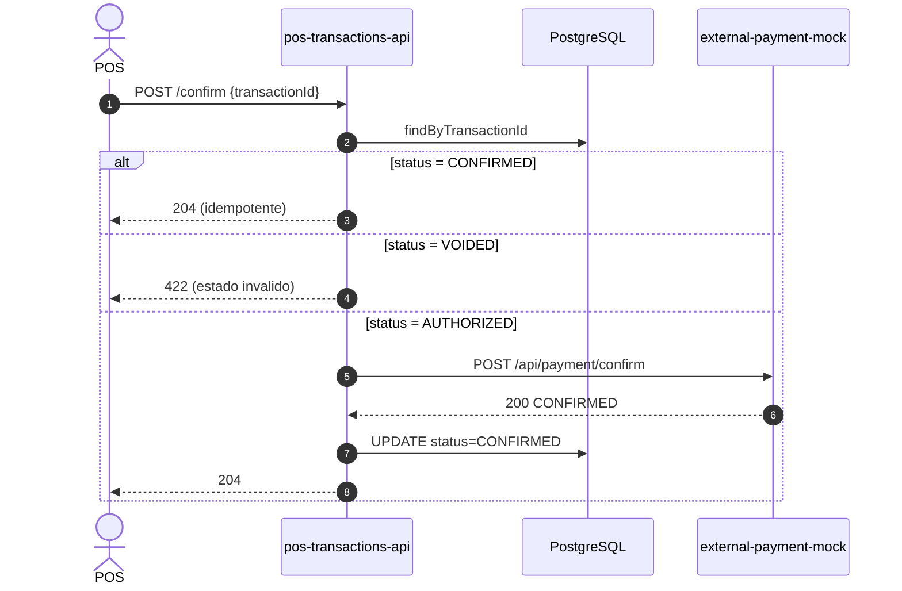
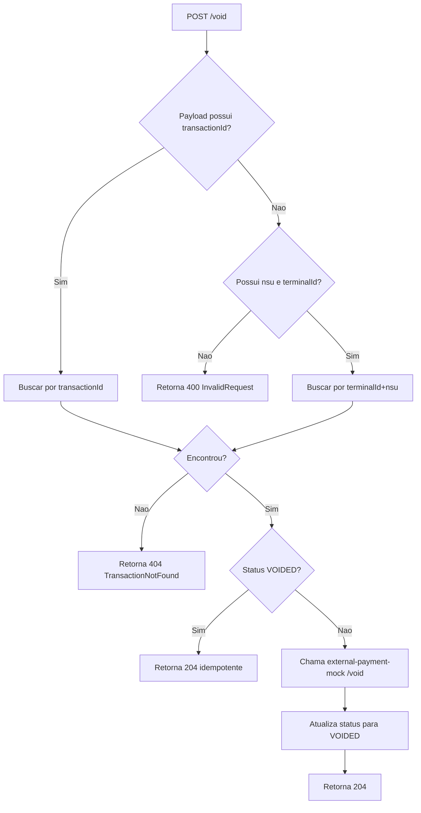
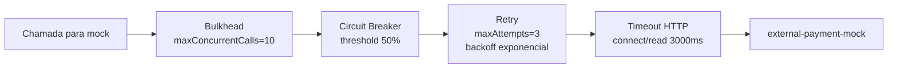

# POS Transactions Platform

Plataforma cloud-native para processamento de transacoes POS (Point of Sale), organizada como **monorepo Maven multi-modulo**.

> Referencia arquitetural detalhada: `ARCHITECTURE.md`.

---

## Sumario

1. [Visao Geral](#1-visao-geral)
2. [Arquitetura Atual](#2-arquitetura-atual)
3. [Modulos e Responsabilidades](#3-modulos-e-responsabilidades)
4. [Fluxos e Diagramas](#4-fluxos-e-diagramas)
5. [Endpoints e Contratos](#5-endpoints-e-contratos)
6. [Seguranca HMAC](#6-seguranca-hmac)
7. [Idempotencia e Estados](#7-idempotencia-e-estados)
8. [Resiliencia](#8-resiliencia)
9. [Observabilidade](#9-observabilidade)
10. [Como Executar](#10-como-executar)
11. [Testes](#11-testes)
12. [Collection Postman](#12-collection-postman)
13. [Estrutura do Projeto](#13-estrutura-do-projeto)

---

## 1. Visao Geral

A aplicacao hoje possui:

- **2 servicos Spring Boot executaveis**:
  - `pos-transactions-api` (porta `8080`)
  - `external-payment-mock` (porta `8081`)
- **1 biblioteca compartilhada**:
  - `auth-commons` (JAR, sem endpoint HTTP)
- **1 banco PostgreSQL** (porta `5432`)

A API principal valida HMAC, aplica idempotencia, persiste no banco e chama o mock externo com Resilience4j.

---

## 2. Arquitetura Atual



### Dependencia de subida (docker-compose)



---

## 3. Modulos e Responsabilidades

| Modulo | Tipo | Porta | Responsabilidade |
|---|---|---:|---|
| `auth-commons` | Biblioteca JAR | - | Validacao HMAC compartilhada (`HmacSignatureFilter`, properties, request wrapper) |
| `pos-transactions-api` | Spring Boot | 8080 | Fluxo de autorizacao/confirmacao/void, idempotencia, persistencia, resiliencia |
| `external-payment-mock` | Spring Boot | 8081 | Simulacao de adquirente/processadora |

---

## 4. Fluxos e Diagramas

### 4.1 Autorizar (nova transacao)



### 4.2 Autorizar (idempotencia)



### 4.3 Confirmar



### 4.4 Void



### 4.5 Resiliencia na chamada externa



---

## 5. Endpoints e Contratos

Base URL da API principal: `http://localhost:8080`

### 5.1 Autorizar

`POST /v1/pos/transactions/authorize`

```json
{
  "nsu": "123456",
  "amount": 199.90,
  "terminalId": "T-1000"
}
```

Resposta `200`:

```json
{
  "nsu": "123456",
  "amount": 199.90,
  "terminalId": "T-1000",
  "transactionId": "A1B2C3..."
}
```

### 5.2 Confirmar

`POST /v1/pos/transactions/confirm`

```json
{ "transactionId": "A1B2C3..." }
```

Resposta: `204 No Content`

### 5.3 Void

`POST /v1/pos/transactions/void`

Forma A:

```json
{ "transactionId": "A1B2C3..." }
```

Forma B:

```json
{ "nsu": "123456", "terminalId": "T-1000" }
```

Resposta: `204 No Content`

### 5.4 Codigos de erro

| Codigo | Quando |
|---|---|
| `400` | Body invalido ou falta `transactionId` e tambem `nsu+terminalId` no void |
| `401` | HMAC invalido, timestamp invalido/expirado ou headers ausentes |
| `404` | Transacao nao encontrada |
| `422` | Transicao de estado invalida (ex.: confirmar uma VOIDED) |
| `503` | Servico externo indisponivel / Circuit Breaker aberto |

---

## 6. Seguranca HMAC

Headers esperados na API principal (`pos-transactions-api`):

- `X-Timestamp` (epoch em segundos, tolerancia de 300s)
- `X-Signature` (hex HMAC SHA-256)
- `X-Correlation-Id` (opcional)

Formula:

```text
signature = HEX(HMAC_SHA256(secret, "{timestamp}.{rawBody}"))
```

Exemplo rapido (zsh):

```bash
TIMESTAMP=$(date +%s)
BODY='{"nsu":"123456","amount":199.90,"terminalId":"T-1000"}'
SECRET='my-super-secret-key-change-in-production'
SIGNATURE=$(echo -n "${TIMESTAMP}.${BODY}" | openssl dgst -sha256 -hmac "${SECRET}" | awk '{print $2}')
```

> `external-payment-mock` nao exige HMAC. Ele e um simulador de integracao.

---

## 7. Idempotencia e Estados

A idempotencia e persistente e garantida no banco por `UNIQUE(terminal_id, nsu)`.

| Operacao | Estado atual | Resultado |
|---|---|---|
| `authorize` | nao existe | cria `AUTHORIZED` |
| `authorize` | ja existe por `terminalId+nsu` | retorna existente (mesmo `transactionId`) |
| `confirm` | `AUTHORIZED` | vira `CONFIRMED` |
| `confirm` | `CONFIRMED` | `204` idempotente |
| `confirm` | `VOIDED` | `422` |
| `void` | `AUTHORIZED` ou `CONFIRMED` | vira `VOIDED` |
| `void` | `VOIDED` | `204` idempotente |

---

## 8. Resiliencia

Configuracao aplicada nas chamadas HTTP para `external-payment-mock`:

- Circuit Breaker
  - `slidingWindowSize: 10`
  - `minimumNumberOfCalls: 5`
  - `failureRateThreshold: 50`
  - `waitDurationInOpenState: 30s`
- Retry
  - `maxAttempts: 3`
  - `waitDuration: 500ms`
  - `enableExponentialBackoff: true`
  - `exponentialBackoffMultiplier: 2`
- Bulkhead
  - `maxConcurrentCalls: 10`
  - `maxWaitDuration: 100ms`
- Timeout HTTP
  - `external.payment.timeout-ms: 3000`
  - aplicado via `SimpleClientHttpRequestFactory` no `RestClient`

---

## 9. Observabilidade

- Correlation ID por request (`X-Correlation-Id`) com propagacao em resposta e MDC
- Logging com padrao contendo `correlationId`
- Actuator na API principal:
  - `GET /actuator/health`
  - `GET /actuator/circuitbreakers`
  - `GET /actuator/metrics`

No mock externo:

- `GET /actuator/health`
- `GET /actuator/info`

---

## 10. Como Executar

### 10.1 Build completo do monorepo

```bash
mvn clean install
```

### 10.2 Subir stack completa com Docker

```bash
docker-compose up --build -d
docker-compose ps
```

Verificacoes:

```bash
curl -s http://localhost:8080/actuator/health | jq .status
curl -s http://localhost:8081/actuator/health | jq .status
```

### 10.3 Rodar servicos separadamente (sem Docker para API)

Suba dependencias:

```bash
docker-compose up -d postgres external-payment-mock
```

Rode a API principal localmente:

```bash
mvn -pl pos-transactions-api spring-boot:run
```

Rode o mock localmente (alternativo):

```bash
mvn -pl external-payment-mock spring-boot:run
```

### 10.4 Variaveis de ambiente relevantes

| Variavel | Uso |
|---|---|
| `DATABASE_URL` | JDBC URL da API principal |
| `DATABASE_USERNAME` | usuario do banco |
| `DATABASE_PASSWORD` | senha do banco |
| `EXTERNAL_PAYMENT_URL` | URL do mock externo |
| `EXTERNAL_PAYMENT_TIMEOUT_MS` | timeout HTTP da API para o mock |
 | `SECURITY_HMAC_SECRET` | chave HMAC (variável usada no `docker-compose` e mapeada para `security.hmac.secret`) |
 | `SECURITY_HMAC_ENABLED` | habilita/desabilita HMAC (variável usada no `docker-compose` e mapeada para `security.hmac.enabled`) |
 
 Nota: historicamente o projeto também mencionou `HMAC_SECRET` / `HMAC_ENABLED` como placeholders; a configuração atual no `docker-compose.yml` e nas propriedades Spring utiliza `SECURITY_HMAC_SECRET` e `SECURITY_HMAC_ENABLED`. É recomendado usar as variáveis `SECURITY_*` para consistência entre ambientes.

---

## 11. Testes

Executar tudo:

```bash
mvn clean install
```

Executar apenas testes do modulo API:

```bash
mvn -pl pos-transactions-api test
```

Executar suites especificas:

```bash
mvn -pl pos-transactions-api test -Dtest="HmacSignatureFilterTest,TransactionServiceTest"
mvn -pl pos-transactions-api test -Dtest="CucumberTestRunner"
```

Cobertura atual observada no projeto:

- Unitarios: `HmacSignatureFilterTest`, `TransactionServiceTest`
- BDD: `authorize_transaction.feature`, `confirm_transaction.feature`, `void_transaction.feature`

---

## 12. Collection Postman

Arquivo: `pos-transactions-collection.json`

Atualizada para o comportamento atual, incluindo:

- Pre-request de HMAC automatico
- Fluxos de authorize/confirm/void com idempotencia
- Erros `400`, `404`, `422`
- Observabilidade (actuator)
- Chamadas diretas ao `external-payment-mock` em `{{baseUrlMock}}`

Passos:

1. Importar `pos-transactions-collection.json`
2. Conferir variaveis `baseUrl`, `baseUrlMock`, `hmacSecret`
3. Executar a colecao completa

---

## 13. Estrutura do Projeto

```text
pos-transactions/
|-- pom.xml                          (parent: pos-transactions-platform)
|-- docker-compose.yml
|-- README.md
|-- ARCHITECTURE.md
|-- pos-transactions-collection.json
|
|-- auth-commons/
|   |-- pom.xml
|   `-- src/main/java/com/pos/auth/
|       |-- autoconfigure/AuthCommonsAutoConfiguration.java
|       `-- config/
|           |-- HmacSignatureFilter.java
|           |-- HmacSignatureProperties.java
|           `-- CachedBodyHttpServletRequest.java
|
|-- pos-transactions-api/
|   |-- pom.xml
|   |-- Dockerfile
|   `-- src/
|       |-- main/java/com/pos/transactions/
|       |   |-- PosTransactionsApplication.java
|       |   |-- controller/
|       |   |-- service/
|       |   |-- repository/
|       |   |-- domain/
|       |   |-- dto/
|       |   `-- config/
|       |-- main/resources/application.yml
|       `-- test/
|
`-- external-payment-mock/
    |-- pom.xml
    |-- Dockerfile
    `-- src/main/java/com/pos/external/
        |-- ExternalPaymentMockApplication.java
        |-- controller/PaymentMockController.java
        `-- dto/
```
